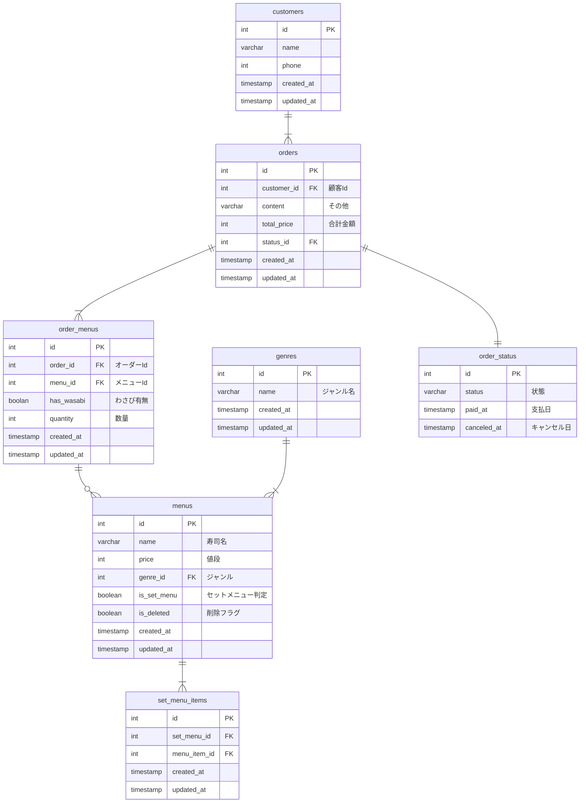

# 命名規則

- テーブル名、カラム名は全てスネークケースで定義する
- boolean 型の項目は、`is_`または`has_`を使って定義する
- テーブル名は複数形で定義する
  - 調べている過程で、複数、単数で派閥ありそう。個人開発で複数形が多いので、複数形で定義してます

# 設計方針

- ## 支払いの扱いについて

  - `paid_at`に日付が入ることで、支払い済みとし、`Null`の場合は未払いとなる。

  - 万が一キャンセルとなった場合、`canceld_at`に日付が入り、キャンセルデータは見ない。

- ## セットメニューの扱いについて

  - セットメニューと単品メニューの扱いを分けて定義した。

  - セットメニュー内の寿司は`set_products`にて単品メニューを参照することができる。

- ## 値段の変更について

  - セットメニュー、単品メニューの値段変更がある場合、`is_delete`を`true`とし、

  - 値段を変更したレコードを追加することで、過去の購買履歴に干渉せずに、値段変更ができるようにした。

- ## 地元に生まれた味メニューについて

  - 鮨八宝巻は、化粧箱の有、無の 2 パターンをメニュー(menus)に登録する

- ## 注文状態管理について

  - 注文状態は、別テーブル`order_status`に切り出して管理する。

  - アプリ側で Enum 管理することで、ステータスの値については DB と切り離して考える。

# 参考資料

[参考資料](https://bagelee.com/programming/rdb-set-menu/)からセットメニューを考慮した設計手法を参考に再度 ER 図を作成する。

# ER 図

