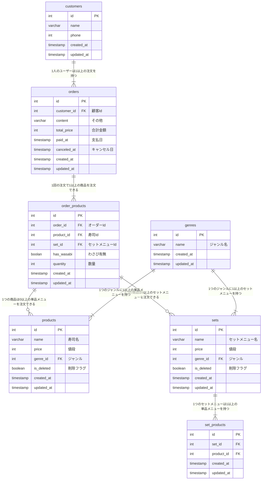

## 命名規則

- テーブル名、カラム名は全てスネークケースで定義する
- boolean 型の項目は、`is_`または`has_`を使って定義する
- テーブル名は複数形で定義する
  - 調べている過程で、複数、単数で派閥ありそう。個人開発で複数形が多いので、複数形で定義してます

## 設計意図

### 支払いの扱いについて

`paid_at`に日付が入ることで、支払い済みとし、`Null`の場合は未払いとなる。
万が一キャンセルとなった場合、`canceld_at`に日付が入り、キャンセルデータは見ない。

### セットメニューの扱いについて

セットメニューと単品メニューの扱いを分けて定義した
セットメニュー内の寿司ネタは`set_products`にて単品メニューと結合することで、内容が見ることができる

## ER 図

