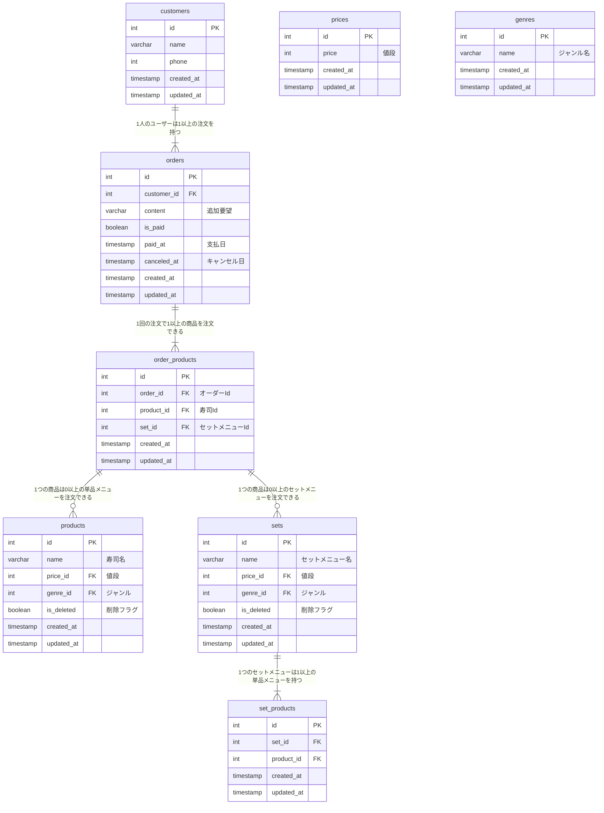

## 命名規則

- テーブル名、カラム名は全てスネークケースで表現する
- boolean型の項目は、`is_`または`has_`を使って表現する

## 設計意図

- 値段の変更やジャンルの変更、季節のネタが追加、削除されることを考慮した設計
- 

```mermaid
erDiagram
    customers ||--|{ orders : "1人のユーザーは1以上の注文を持つ"
    orders ||--|{ order_products: "1回の注文で1以上の商品を注文できる"
    order_products ||--o{ products: "1つの商品は0以上の単品メニューを注文できる"
    order_products ||--o{ sets: "1つの商品は0以上のセットメニューを注文できる"
    sets ||--|{ set_products: "1つのセットメニューは1以上の単品メニューを持つ"

    customers {
        int id PK
        varchar name
        int phone
        timestamp created_at
        timestamp updated_at
    }

    products {
        int id PK
        varchar name "寿司名"
        int price_id FK "値段"
        int genre_id FK "ジャンル"
        boolean is_deleted "削除フラグ"
        timestamp created_at
        timestamp updated_at
    }

    orders {
        int id PK
        int customer_id FK
        varchar content "追加要望"
        boolean is_paid
        timestamp paid_at "支払日"
        timestamp canceled_at "キャンセル日"
        timestamp created_at
        timestamp updated_at
    }

    order_products {
        int id PK
        int order_id FK "オーダーId"
        int product_id FK "寿司Id"
        int set_id FK "セットメニューId"
        timestamp created_at
        timestamp updated_at
    }

    sets {
        int id PK
        varchar name "セットメニュー名"
        int price_id FK "値段"
        int genre_id FK "ジャンル"
        boolean is_deleted "削除フラグ"
        timestamp created_at
        timestamp updated_at
    }

    set_products {
        int id PK
        int set_id FK
        int product_id FK
        timestamp created_at
        timestamp updated_at
    }

    prices {
        int id PK
        int price "値段"
        timestamp created_at
        timestamp updated_at
    }

    genres {
        int id PK
        varchar name "ジャンル名"
        timestamp created_at
        timestamp updated_at
    }
```
