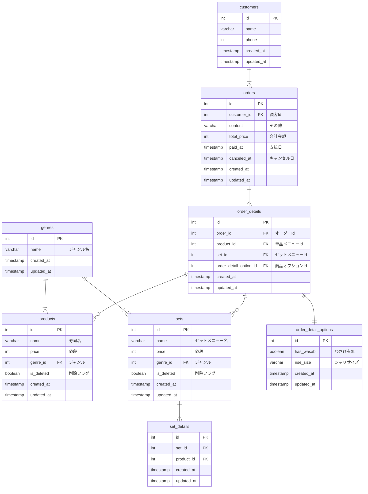

## ER 図

この設計で問題ないと思っている。

```mermaid
erDiagram
    customers ||--|{ orders : ""
    orders ||--|{ order_details : ""
    order_details ||--o{ products : ""
    order_details ||--o{ sets : ""
    sets ||--|{ set_details : ""
    genres ||--|{ products : ""
    genres ||--|{ sets : ""
    order_details ||--|| order_detail_options : ""

    customers {
        int id PK
        varchar name
        int phone
        timestamp created_at
        timestamp updated_at
    }

    products {
        int id PK
        varchar name "寿司名"
        int price "値段"
        int genre_id FK "ジャンル"
        boolean is_deleted "削除フラグ"
        timestamp created_at
        timestamp updated_at
    }

    orders {
        int id PK
        int customer_id FK "顧客Id"
        varchar content "その他"
        int total_price "合計金額"
        timestamp paid_at "支払日"
        timestamp canceled_at "キャンセル日"
        timestamp created_at
        timestamp updated_at
    }

    order_details {
        int id PK
        int order_id FK "オーダーId"
        int product_id FK "単品メニューId"
        int set_id FK "セットメニューId"
        int order_detail_option_id FK "商品オプションId"
        timestamp created_at
        timestamp updated_at
    }

    order_detail_options {
        int id PK
        boolean has_wasabi "わさび有無"
        varchar rise_size "シャリサイズ"
        timestamp created_at
        timestamp updated_at
    }

    sets {
        int id PK
        varchar name "セットメニュー名"
        int price "値段"
        int genre_id FK "ジャンル"
        boolean is_deleted "削除フラグ"
        timestamp created_at
        timestamp updated_at
    }

    set_details {
        int id PK
        int set_id FK
        int product_id FK
        timestamp created_at
        timestamp updated_at
    }

    genres {
        int id PK
        varchar name "ジャンル名"
        timestamp created_at
        timestamp updated_at
    }
```
