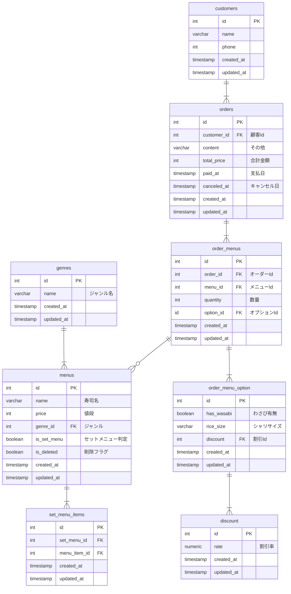

## 追加条件

タイムセールなどの割引ができるような仕様を追加する

## ER 図

```mermaid
erDiagram
    customers ||--|{ orders : ""
    orders ||--|{ order_menus : ""
    order_menus ||--o{ menus : ""
    menus ||--|{ set_menu_items : ""
    genres ||--|{ menus : ""
    order_menus ||--|{ order_menu_option : ""
    order_menu_option ||--|{ discount : ""

    customers {
        int id PK
        varchar name
        int phone
        timestamp created_at
        timestamp updated_at
    }

    menus {
        int id PK
        varchar name "寿司名"
        int price "値段"
        int genre_id FK "ジャンル"
        boolean is_set_menu "セットメニュー判定"
        boolean is_deleted "削除フラグ"
        timestamp created_at
        timestamp updated_at
    }

    orders {
        int id PK
        int customer_id FK "顧客Id"
        varchar content "その他"
        int total_price "合計金額"
        timestamp paid_at "支払日"
        timestamp canceled_at "キャンセル日"
        timestamp created_at
        timestamp updated_at
    }

    order_menus {
        int id PK
        int order_id FK "オーダーId"
        int menu_id FK "メニューId"
        int quantity "数量"
        id option_id FK "オプションId"
        timestamp created_at
        timestamp updated_at
    }

    order_menu_option {
        int id PK
        boolean has_wasabi "わさび有無"
        varchar rice_size "シャリサイズ"
        int discount FK "割引Id"
        timestamp created_at
        timestamp updated_at
    }

    discount {
      int id PK
      numeric rate "割引率"
      timestamp created_at
      timestamp updated_at
    }

    set_menu_items {
        int id PK
        int set_menu_id FK
        int menu_item_id FK
        timestamp created_at
        timestamp updated_at
    }

    genres {
        int id PK
        varchar name "ジャンル名"
        timestamp created_at
        timestamp updated_at
    }
```
