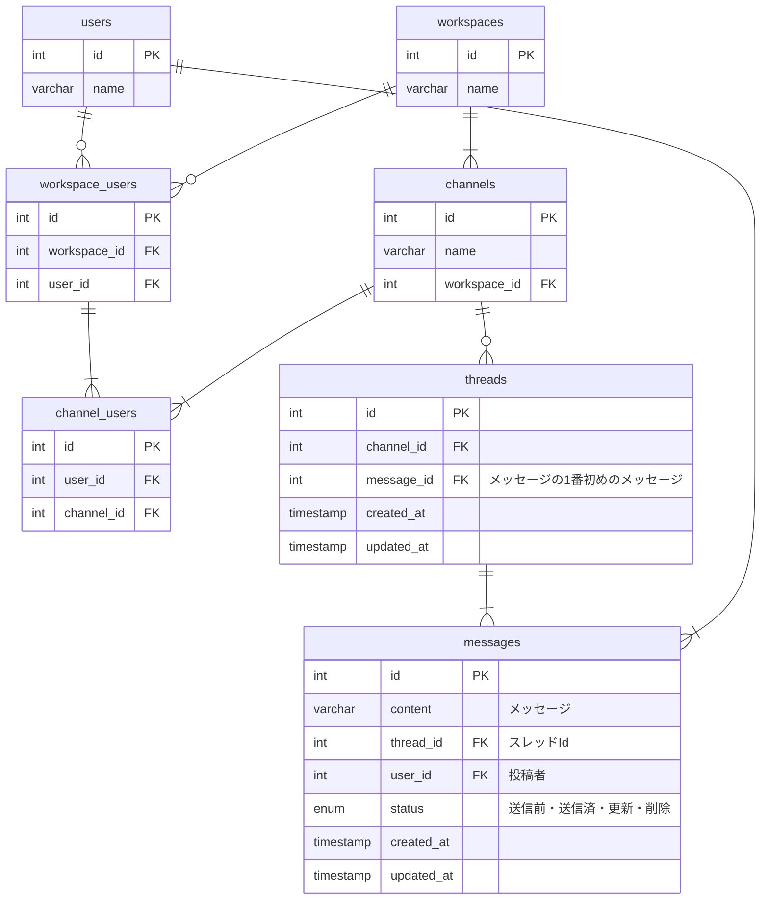

## 課題 URL

https://separated-rover-67e.notion.site/1-feff30c6daf84d80b0ef44d4853ea8a3

## 命名規則

- テーブル名は`複数形`、`スネークケース`で定義する
- 主キーは全て`id`で定義する
- カラム名は`単数形`、`スネークケース`で定義する
- リレーションを表現する場合、`テーブル名単数形_id`で定義する

## ER 図



## DDL

```

CREATE TABLE users (
    id SERIAL PRIMARY KEY,
    name VARCHAR(255) NOT NULL
);

CREATE TABLE workspaces (
    id SERIAL PRIMARY KEY,
    name VARCHAR(255) NOT NULL
);

CREATE TABLE workspace_users (
    id SERIAL PRIMARY KEY,
    workspace_id INT NOT NULL,
    user_id INT NOT NULL,
    FOREIGN KEY (workspace_id) REFERENCES workspaces(id) ON DELETE CASCADE,
    FOREIGN KEY (user_id) REFERENCES users(id) ON DELETE CASCADE
);

CREATE TABLE channels (
    id SERIAL PRIMARY KEY,
    name VARCHAR(255) NOT NULL,
    workspace_id INT NOT NULL,
    FOREIGN KEY (workspace_id) REFERENCES workspaces(id) ON DELETE CASCADE
);

CREATE TABLE channel_users (
    id SERIAL PRIMARY KEY,
    user_id INT NOT NULL,
    channel_id INT NOT NULL,
    FOREIGN KEY (user_id) REFERENCES users(id) ON DELETE CASCADE,
    FOREIGN KEY (channel_id) REFERENCES channels(id) ON DELETE CASCADE
);

CREATE TABLE threads (
    id SERIAL PRIMARY KEY,
    channel_id INT NOT NULL,
    message_id INT NOT NULL, -- 最初のメッセージ
    created_at TIMESTAMP DEFAULT CURRENT_TIMESTAMP,
    updated_at TIMESTAMP DEFAULT CURRENT_TIMESTAMP,
    FOREIGN KEY (channel_id) REFERENCES channels(id) ON DELETE CASCADE,
    FOREIGN KEY (message_id) REFERENCES messages(id) ON DELETE CASCADE
);

CREATE TYPE message_status AS ENUM ('draft', 'sent', 'edited', 'deleted');

CREATE TABLE messages (
    id SERIAL PRIMARY KEY,
    content TEXT NOT NULL,
    thread_id INT NOT NULL,
    user_id INT NOT NULL,
    status message_status NOT NULL DEFAULT 'draft',
    created_at TIMESTAMP DEFAULT CURRENT_TIMESTAMP,
    updated_at TIMESTAMP DEFAULT CURRENT_TIMESTAMP,
    FOREIGN KEY (thread_id) REFERENCES threads(id) ON DELETE CASCADE,
    FOREIGN KEY (user_id) REFERENCES users(id) ON DELETE CASCADE
);

```

## DML

```

INSERT INTO users (name) VALUES ('山田 太郎'), ('佐藤 花子'), ('高橋 健');
INSERT INTO workspaces (name) VALUES ('開発チーム'), ('営業チーム'), ('デザインチーム');
INSERT INTO workspace_users (workspace_id, user_id) VALUES (1, 1), (1, 2), (2, 1), (2, 3), (3, 2), (3, 3);
INSERT INTO channels (name, workspace_id) VALUES ('一般', 1), ('技術情報', 1), ('デザイン相談', 3);
INSERT INTO channel_users (user_id, channel_id) VALUES (1, 1), (2, 1), (1, 2), (3, 3), (2, 3), (3, 2);
INSERT INTO threads (channel_id, message_id) VALUES (1, 1), (2, 2), (3, 3);
INSERT INTO messages (content, thread_id, user_id, status) VALUES ('こんにちは！', 1, 1, 'sent'), ('よろしくお願いします！', 2, 2, 'sent'), ('デザインについて相談です', 3, 3, 'sent');

```
