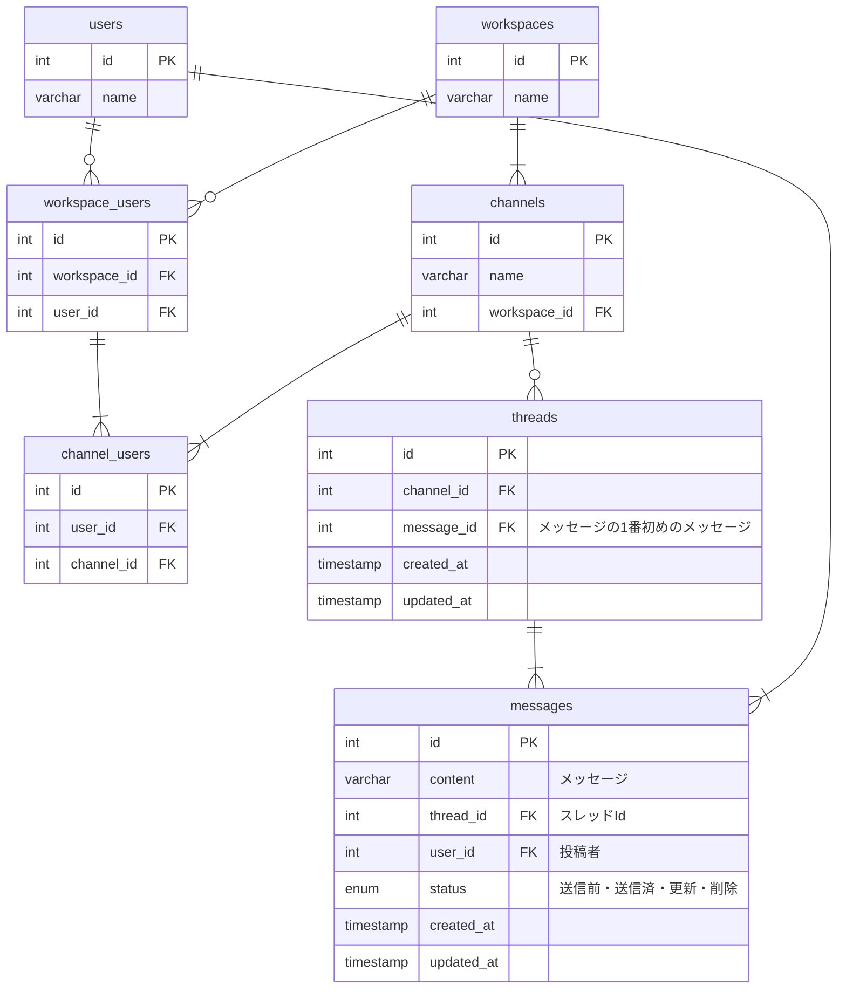

## 課題 URL

https://separated-rover-67e.notion.site/1-feff30c6daf84d80b0ef44d4853ea8a3

## 命名規則

- テーブル名は`複数形`、`スネークケース`で定義する
- 主キーは全て`id`で定義する
- カラム名は`単数形`、`スネークケース`で定義する
- リレーションを表現する場合、`テーブル名単数形_id`で定義する

## ER 図

