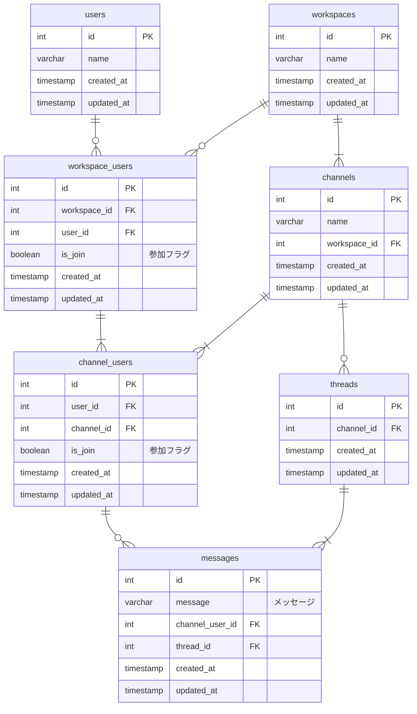

## 課題 URL

https://separated-rover-67e.notion.site/1-feff30c6daf84d80b0ef44d4853ea8a3

## 命名規則

## ER 図

```mermaid
erDiagram
    users ||--o{ workspace_users : ""
    workspaces ||--o{ workspace_users : ""
    workspaces ||--|{ channels : ""
    workspace_users ||--|{ channel_users : ""
    channels ||--|{ channel_users : ""
    channels ||--o{ threads : ""
    threads ||--|{ messages : ""
    channel_users ||--o{ messages : ""

    users {
        int id PK
        varchar name
        timestamp created_at
        timestamp updated_at
    }

    workspaces {
        int id PK
        varchar name
        timestamp created_at
        timestamp updated_at
    }

    workspace_users {
        int id PK
        int workspace_id FK
        int user_id FK
        boolean is_join "参加フラグ"
        timestamp created_at
        timestamp updated_at
    }

    channels {
        int id PK
        varchar name
        int workspace_id FK
        timestamp created_at
        timestamp updated_at
    }

    channel_users {
        int id PK
        int user_id FK
        int channel_id FK
        boolean is_join "参加フラグ"
        timestamp created_at
        timestamp updated_at
    }

    messages {
        int id PK
        varchar message "メッセージ"
        int channel_user_id FK
        int thread_id FK
        timestamp created_at
        timestamp updated_at
    }

    threads {
        int id PK
        int channel_id FK
        timestamp created_at
        timestamp updated_at
    }
```
