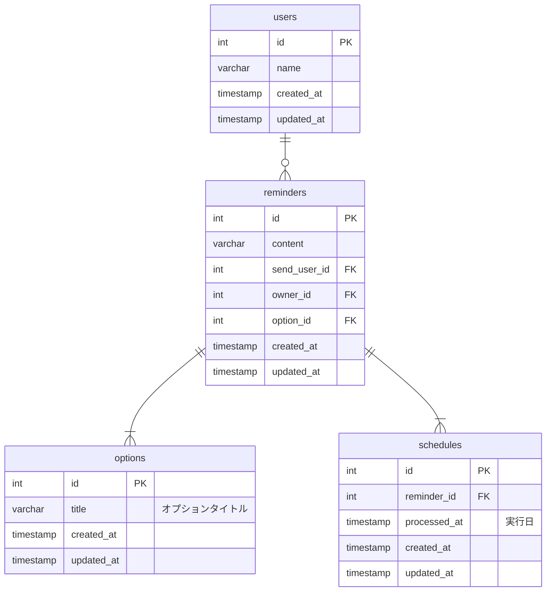

## 課題 URL

https://separated-rover-67e.notion.site/1-d9d1f0547084459aa1ef718d1e342221

## 命名規則

## ER 図

```mermaid
erDiagram
    users ||--o{ reminders : ""
    reminders ||--|{ options : ""
    reminders ||--|{ schedules : ""

    users {
        int id PK
        varchar name
        timestamp created_at
        timestamp updated_at
    }

    reminders {
        int id PK
        varchar content
        int send_user_id FK
        int owner_id FK
        int option_id FK
        timestamp created_at
        timestamp updated_at
    }

    schedules {
        int id PK
        int reminder_id FK
        timestamp processed_at "実行日"
        timestamp created_at
        timestamp updated_at
    }

    options {
        int id PK
        varchar title "オプションタイトル"
        timestamp created_at
        timestamp updated_at
    }
```
