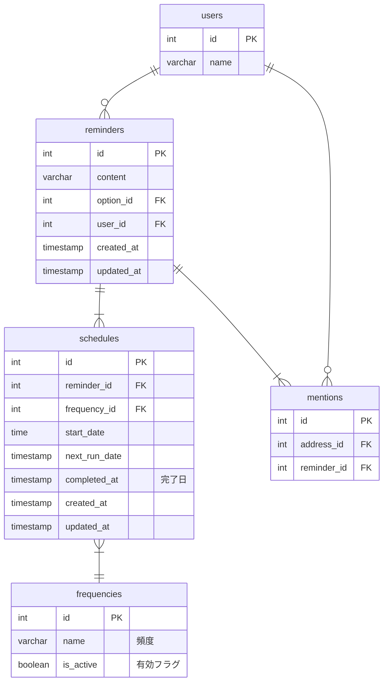

## 課題 URL

https://separated-rover-67e.notion.site/4-300287c1384d4f8d905741fc0cc3f007

## 命名規則

## ER 図

```mermaid
erDiagram
    users ||--o{ reminders : ""
    reminders ||--|{ schedules : ""
    reminders ||--|{ mentions : ""
    users ||--o{ mentions : ""
    schedules }|--|| frequencies : ""

    users {
        int id PK
        varchar name
    }

    reminders {
        int id PK
        varchar content
        int option_id FK
        int user_id FK
        timestamp created_at
        timestamp updated_at
    }

    mentions {
      int id PK
      int address_id FK
      int reminder_id FK
    }

    schedules {
        int id PK
        int reminder_id FK
        int frequency_id FK
        time start_date
        timestamp next_run_date
        timestamp completed_at "完了日"
        timestamp created_at
        timestamp updated_at
    }

    frequencies {
        int id PK
        varchar name "頻度"
        boolean is_active "有効フラグ"
    }
```
